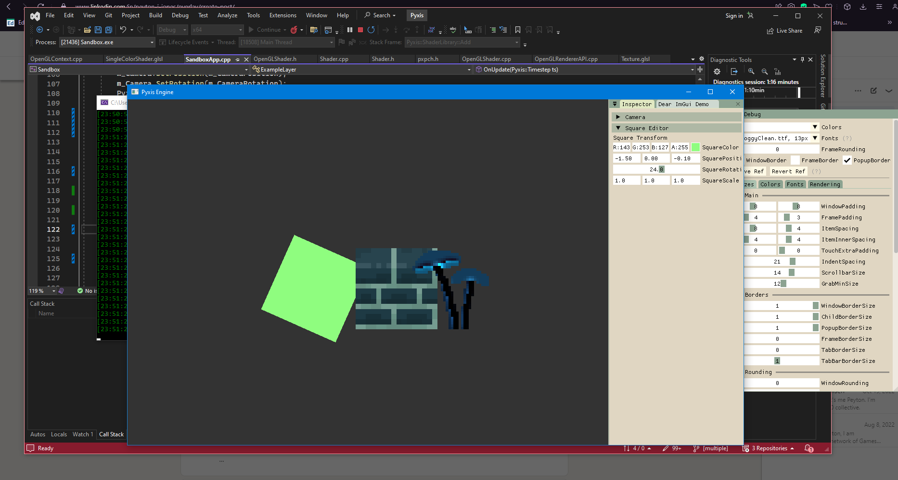

# In This Repo:
* Pyxis (/pixel-game ) The main falling sand game
* Pyxis Server (/pixel-game-server) Server for Pyxis
* Pyxis Game Engine (Main) - The main game engine, which will either become a falling sand engine, or a voxel engine.
* Pyxis-Editor (/pyxis-editor) - What would be the editor of the Pyxis Engine
* Sandbox (/sandbox) - Used for testing random core experimental things

# Pyxis 

Pyxis, as it is now, is a multiplayer falling sand simulation. My inspiration began with [Noita](https://store.steampowered.com/app/881100/Noita/), and I hope I am able to craft it into either a sandbox survival game, or a little-big-planet like sandbox. It is my favorite personal project so far, and probably my best work. Things still need work, but it is pretty stable!

### Key Features:
*  Multiplayer
*  Infinite World
*  Dynamic / Static Rigid Bodies with runtime deformation
* Easy to create and customizable elements, and element reaction system, all de-serialized with xml

### Notes
Server's port is 21218, and everything is run on TCP at the moment(very laggy :( )

Clients aren't yet able to slow down for each other, so the client farthest in the lead has to wait on the one furthest behind. will be fixed soon!

# Pyxis Game Engine & Editor

A game engine written in C++ for learning purposes and personal use. 

Will either end up as a falling sand engine, a 2d game engine, or a voxel engine (or all fuck it). The goal regardless for the editor is to make it an adorable 2D(or voxel) game engine with an aseprite-like pixel-art theme!

### About

This engine was made by following [TheCherno](https://www.youtube.com/@TheCherno)'s game engine series on Youtube, where he creates the Hazel game engine. For this reason, the base engine code will be almost, if not exactly, the same as it is there.

The project uses [Premake 5](https://github.com/premake/premake-core) to build solution files, and currently has support for windows, but should be feasable to make Linux or Mac support using it.

I only use Premake 5 simply because I seen TheCherno using it, but I feel like CMake is more modern / common...

### Currently Used Frameworks/Libraries/Software/API/ect.

* [OpenGL](https://www.opengl.org)

* [GLFW](https://github.com/glfw/glfw) (GLFW is an Open Source, multi-platform library for OpenGL)

* [GLAD](https://glad.dav1d.de) (Vulkan/GL/GLES/EGL/GLX/WGL Loader-Generator)

* [GLM](https://github.com/g-truc/glm) (GLM is an OpenGL based C++ mathematics library for graphics software)

* [ImGui](https://github.com/ocornut/imgui) (Dear ImGui is a bloat-free graphical user interface library for C++)

* [spdlog](https://github.com/gabime/spdlog) (Very fast, header-only/compiled, C++ logging library.)

* [tinyXML2](https://github.com/leethomason/tinyxml2) (TinyXML-2 is a simple, small, efficient, C++ XML parser)
* (Planned) ASSIMP (In repository, not yet implemented) 
* [Box2D](https://box2d.org) (A 2D Physics Engine for Games)
* [Poly2Tri](https://github.com/jhasse/poly2tri) (A 2D constrained Delaunay triangulation library)
* [ASIO](https://think-async.com/Asio/) (Asio is a cross-platform C++ library for network and low-level I/O programming)

### What I've Learned

I've learned a lot about:

**Projects:**

* Pre-Processor Definitions

* Precompiled Headers

* Core - App Linking

* Solution Building Through Premake5 / Cmake / ect

**Programming**
* Using linear algebra for lighting calculations and different space matrices
* Networking
* A LOT of practice with Header Definitions and CPP Implementations, inlining in some places ;)
* Picking a style and sticking to it (cleaner and more consistent code)
* Static Cast(Compile Time) vs Dynamic Cast (Runtime, does inheritance check)
* Douglas-Peucker & other algorithgms

**OpenGL/GLAD/GLFW/ImGui**
* Rendering / Graphics pipeline
* Creating and using GLSL shaders
* Phong Lighting
* More practice with meshes, vertices, triangles, ect
* ImGui GUI rendering

### What it looks like  now:
